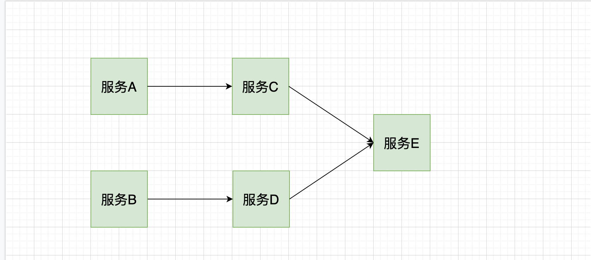
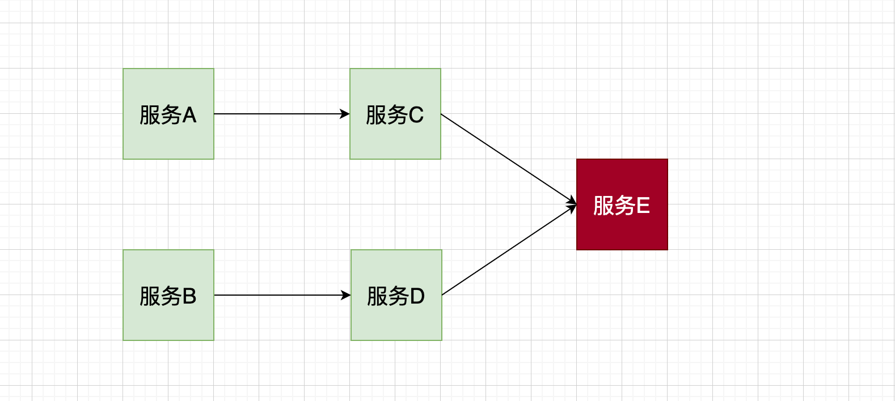
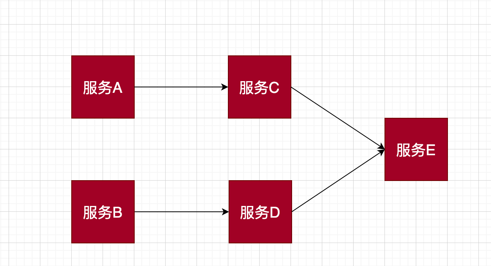

# 熔断机制

## 为什么需要熔断？
比如一个微服务化的产品线上，每一个服务都专注于自己的业务，并对外提供相应的服务接口，或者依赖于外部服务的某个逻辑接口，就像下面这样

假设我们当前是 `服务A`，有部分逻辑依赖于 `服务C`，`服务C` 又依赖于 `服务E`, 当前微服务之间进行 `rpc` 或者 `http` 通信，假设此时 `服务C` 调用 `服务E` 失败，比如由于网络波动导致超时或者`服务E` 由于过载已经 down 掉了

调用失败，一般会有失败重试等机制。但是再想想，假设 `服务E` 已然不可用的情况下，此时新的调用不断产生，同时伴随着调用等待和失败重试，会导致 `服务C` 对 `服务E` 的调用而产生大量的积压，慢慢会耗尽 `服务C` 的资源，进而导致 `服务C` 也 down 掉，这样恶性循环下，会影响到整个微服务体系，产生**雪崩效应**

虽然导致雪崩的发生不仅仅这一种，但是我们需要采取一定的措施，来保证不让这个噩梦发生。

## 熔断器原理
> 熔断机制其实是参考了我们日常生活中的保险丝的保护机制，当电路超负荷运行时，保险丝会自动的断开，从而保证电路中的电器不受损害。而服务治理中的熔断机制，指的是在发起服务调用的时候，如果被调用方返回的错误率超过一定的阈值，那么后续将不会真正地发起请求，而是在调用方直接返回错误

在这种模式下，服务调用方为每一个调用服务(调用路径)维护一个状态机，在这个状态机中有三个状态：
+ `关闭(Closed)`：在这种状态下，我们需要一个计数器来记录调用失败的次数和总的请求次数，如果在某个时间窗口内，失败的失败率达到预设的阈值，则切换到断开状态，此时开启一个超时时间，当到达该时间则切换到半关闭状态，该超时时间是给了系统一次机会来修正导致调用失败的错误，以回到正常的工作状态。在关闭状态下，调用错误是基于时间的，在特定的时间间隔内会重置，这能够防止偶然错误导致熔断器进入断开状态
+ `打开(Open)`：在该状态下，发起请求时会立即返回错误，一般会启动一个超时计时器，当计时器超时后，状态切换到半打开状态，也可以设置一个定时器，定期的探测服务是否恢复
+ `半打开(Half-Open)`：在该状态下，允许应用程序一定数量的请求发往被调用服务，如果这些调用正常，那么可以认为被调用服务已经恢复正常，此时熔断器切换到关闭状态，同时需要重置计数。如果这部分仍有调用失败的情况，则认为被调用方仍然没有恢复，熔断器会切换到打开状态，然后重置计数器，半打开状态能够有效防止正在恢复中的服务被突然大量请求再次打垮

服务治理中引入熔断机制，使得系统更加稳定和有弹性，在系统从错误中恢复的时候提供稳定性，并且减少了错误对系统性能的影响，可以快速拒绝可能导致错误的服务调用，而不需要等待真正的错误返回

### Hystrix
`Hystrix` 是由 `Netflex` 开发的一款开源组件，提供了基础的熔断功能。`Hystrix` 将降级的策略封装在 `Command` 中，提供了 `run` 和 `fallback` 两个方法，前者表示正常的逻辑，比如微服务之间的调用……，如果发生了故障，再执行 `fallback` 方法返回结果，我们可以把它理解成保底操作。如果正常逻辑在短时间内频繁发生故障，那么可能会触发短路，也就是之后的请求不再执行 `run`, 而是直接执行 `fallback`

## 总结
调用端可以通过熔断机制进行自我保护，防止调用下游服务出现异常，或者耗时过长影响调用端的业务逻辑，很多功能完整的微服务框架都会内置熔断器。其实，不仅微服务调用之间需要熔断器，在调用依赖资源的时候，比如`mysql`、`redis`等也可以引入熔断器的机制